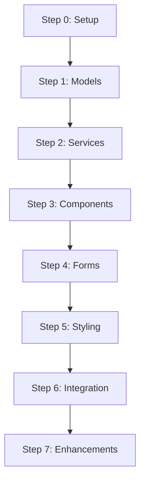

# 🎓 Angular 18 Todo App Workshop Template

> **Template Repository สำหรับการเรียนการสอน Angular 18 + Tailwind CSS + Services**

[](https://angular.io/)
[](https://www.typescriptlang.org/)
[](https://tailwindcss.com/)
[](LICENSE)

## 🚀 เริ่มต้นอย่างรวดเร็ว

### 1. ใช้ Template นี้

คลิก **"Use this template"** หรือ:

```bash
git clone https://github.com/YOUR_USERNAME/angular-todo-workshop.git
cd angular-todo-workshop
npm install
```

### 2. เริ่ม Workshop

```bash
# เริ่มพร้อมกัน API และ App
npm run dev

# หรือเริ่มแยก
npm run api    # Terminal 1: JSON Server
npm start      # Terminal 2: Angular App
```

### 3. เปิดเบราว์เซอร์

- **App**: http://localhost:4200
- **API**: http://localhost:3000

## 📚 สำหรับผู้สอน

### การเตรียม Workshop

1. **Fork template นี้** เป็น repository ของคุณ
2. **Customize** เนื้อหาตามต้องการ
3. **สร้าง branches** สำหรับแต่ละ step:

```bash
git checkout -b step-1-setup
git checkout -b step-2-components
git checkout -b step-3-services
# ...
```

4. **เพิ่ม specific examples** ใน branches

### Structure สำหรับการสอน

```
workshop-sessions/
├── session-1-introduction/     # Overview, Setup
├── session-2-components/       # Components, Signals
├── session-3-services/         # HTTP, Services
├── session-4-forms/           # Reactive Forms
├── session-5-styling/         # Tailwind, Responsive
└── session-6-deployment/      # Build, Deploy
```

## 👨‍🎓 สำหรับผู้เรียน

### เริ่มต้นที่นี่

1. **[WORKSHOP-README.md](./WORKSHOP-README.md)** - คู่มือหลัก
2. **[docs/step-0-setup.md](./docs/step-0-setup.md)** - เริ่มต้น setup
3. **[examples/](./examples/)** - ตัวอย่าง code
4. **[docs/troubleshooting.md](./docs/troubleshooting.md)** - แก้ปัญหา

### ลำดับการเรียนรู้



## 🏗️ โครงสร้างโปรเจค

```
├── 📁 docs/                    # Workshop documentation
│   ├── step-0-setup.md         # เริ่มต้น project
│   ├── step-1-models.md        # TypeScript interfaces
│   ├── step-2-services.md      # HTTP services
│   ├── step-3-components.md    # Angular components
│   ├── step-4-forms.md         # Reactive forms
│   ├── step-5-styling.md       # Tailwind CSS
│   ├── step-6-integration.md   # API integration
│   ├── step-7-enhancement.md   # Advanced features
│   └── troubleshooting.md      # แก้ไขปัญหา
├── 📁 examples/                # Code examples
│   ├── components/             # Component examples
│   ├── services/               # Service examples
│   ├── utils/                  # Helper functions
│   └── complete-examples/      # Complete implementations
├── 📁 api/                     # JSON Server setup
│   ├── db.json                 # Mock data
│   ├── routes.json             # API routes
│   └── server.js               # Custom server
├── 📁 src/app/                 # Main application
│   ├── components/             # Angular components
│   ├── services/               # Application services
│   ├── models/                 # TypeScript interfaces
│   └── utils/                  # Helper utilities
├── 📄 WORKSHOP-README.md       # Main workshop guide
├── 📄 package.json             # Dependencies & scripts
└── 📄 tailwind.config.js       # Tailwind configuration
```

## 🎯 สิ่งที่จะได้เรียนรู้

### Angular 18 Features
- ✅ **Signals** - Reactive state management
- ✅ **Control Flow** - @if, @for, @switch
- ✅ **Standalone Components** - No NgModules
- ✅ **Inject Function** - Modern dependency injection

### TypeScript
- ✅ **Interfaces & Types** - Strong typing
- ✅ **Generics** - Reusable type definitions
- ✅ **Union Types** - Multiple type options
- ✅ **Optional Properties** - Flexible interfaces

### Tailwind CSS
- ✅ **Utility Classes** - Rapid UI development
- ✅ **Responsive Design** - Mobile-first approach
- ✅ **Dark Mode** - Theme switching
- ✅ **Custom Components** - Reusable styles

### Services & HTTP
- ✅ **HttpClient** - API communication
- ✅ **Observables** - Reactive programming
- ✅ **Error Handling** - Robust error management
- ✅ **Interceptors** - Request/response processing

## 📦 Scripts ที่มีให้ใช้

```bash
# Development
npm start              # เริ่ม Angular app
npm run api            # เริ่ม JSON Server
npm run dev            # เริ่มทั้งคู่พร้อมกัน

# Building
npm run build          # Build สำหรับ production
npm run build:stats    # Build พร้อม bundle analysis

# Testing
npm test               # Unit tests
npm run test:coverage  # Test coverage report
npm run e2e            # End-to-end tests

# Code Quality
npm run lint           # ESLint checking
npm run format         # Prettier formatting
npm run type-check     # TypeScript checking

# Utilities
npm run clean          # ลบ node_modules และ reinstall
npm run analyze        # วิเคราะห์ bundle size
npm run update         # อัพเดท dependencies
```

## 🎨 Features ที่จะสร้าง

### Core Features
- ➕ เพิ่ม/แก้ไข/ลบ todos
- ✅ ทำเครื่องหมายเสร็จ/ยังไม่เสร็จ
- 🔍 ค้นหาและกรอง todos
- 📊 แสดงสถิติและ progress

### Advanced Features
- 🌙 Dark/Light mode toggle
- ⌨️ Keyboard shortcuts
- 📱 Responsive design
- 💾 Data persistence
- 📤 Export/Import functionality
- 📈 Analytics และ insights

## 🎓 การใช้งานใน Classroom

### สำหรับผู้สอน

1. **Pre-workshop**:
   - Fork template repository
   - Customize content สำหรับ audience
   - เตรียม environment setup guide

2. **During workshop**:
   - Live coding ตาม steps
   - ให้ students ทำ hands-on exercises
   - ใช้ examples เป็น reference

3. **Post-workshop**:
   - Assignment: ให้ students เพิ่ม features
   - Code review sessions
   - Advanced topics exploration

### สำหรับ Self-Learning

1. **เรียนตามลำดับ** steps 0-7
2. **ทำ exercises** ในแต่ละ step
3. **ดู examples** เมื่อติดปัญหา
4. **สร้าง features เพิ่มเติม** ตามความสนใจ

## 🤝 Contributing

รับ contributions ทุกรูปแบบ!

### การช่วยพัฒนา Workshop

1. **เนื้อหา**: ปรับปรุง documentation
2. **Examples**: เพิ่ม code examples
3. **Exercises**: สร้าง hands-on activities
4. **Translations**: แปลเป็นภาษาอื่น

### Process

1. Fork repository
2. สร้าง feature branch
3. ทำการเปลี่ยนแปลง
4. เขียน tests (ถ้าเป็น code)
5. Submit pull request

## 📄 License

MIT License - ใช้งานได้อย่างอิสระทั้งการศึกษาและเชิงพาณิชย์

## 🙏 Acknowledgments

- **Angular Team** - สำหรับ framework ที่ยอดเยี่ยม
- **Tailwind CSS** - สำหรับ utility-first CSS
- **Community** - สำหรับ feedback และ contributions

---

<div align="center">

**🚀 Ready to start? Begin with [WORKSHOP-README.md](./WORKSHOP-README.md)**

**Made with ❤️ for Angular learners**

---

*Template version: 1.0.0 | Last updated: {{ date }}*

</div>
